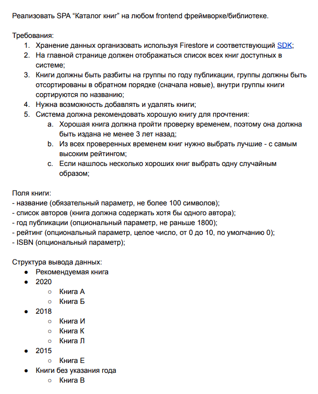

# Проект: Book-catalog

---

## Тестовое задание выглядит так:

### Обзор

- Описание проекта и его функциональности
- Используемые технологии
- Какие команды нужно выполнить для сборки и запуска проекта?
- Ссылка на GitHub Pages

## Описание проекта и его функциональности

Проект представляет из себя католог книг. Книги можно добавлять и удалять. Настроена кастомная валидация формы. Каталог рекомендует одну из лучших книг на портале. Хранение данных организовано с помощью Firestore.

## Используемые технологии

HTML5;
CSS3;
JavaScript ES6;
React 18;

### Также в разработке использовались:

Анимации с помощью CSS;
Flexbox-верстка;
БЭМ-методология;
Адаптивная верстка под различные устройства;
Git.

## Какие команды нужно выполнить для сборки и запуска проекта:

- Склонируйте репозиторий с проектом на свой локальный компьютер: **git clone git@github.com:Allison4444/book-catalog.git**  

- Перейдите в каталог проекта: **cd book-catalog**  

- Установите зависимости, указанные в файле package.json, с помощью команды: **npm install**  

- Запустите проект локально на своем компьютере, используя команду: **npm start** Эта команда запустит локальный сервер и откроет приложение в вашем браузере по адресу **http://localhost:3000**.  

- Для сборки проекта в продакшн режиме, используйте команду: **npm run build** Эта команда создаст оптимизированную версию проекта в папке build.  

Эти команды должны быть достаточными для запуска и сборки проекта **book-catalog**. Обязательно убедитесь, что у вас установлен Node.js и npm, чтобы эти команды работали.

## Ссылка на GitHub Pages:

**https://allison4444.github.io/book-catalog/**
